# 1.先复习一下上一节课的内容

## 1.把上一课的pachong项目移动到G:\my_projects_2026\kenny_learn_scrapy\scrapy_codes里面，然后我们使用下面的命令创建一个dbmv_crawler项目

```
PS G:\my_projects_2026\kenny_learn_scrapy\scrapy_codes> scrapy startproject dbmv_crawler
```


## 2.然后我们进入dbmv_crawlerw文件夹里面，用下面的命令创建一个蜘蛛程序

```
PS G:\my_projects_2026\kenny_learn_scrapy\scrapy_codes\dbmv_crawler> scrapy genspider douban movie.douban.com
```


## 3.然后我们进入douban.py里面，先修改一下url

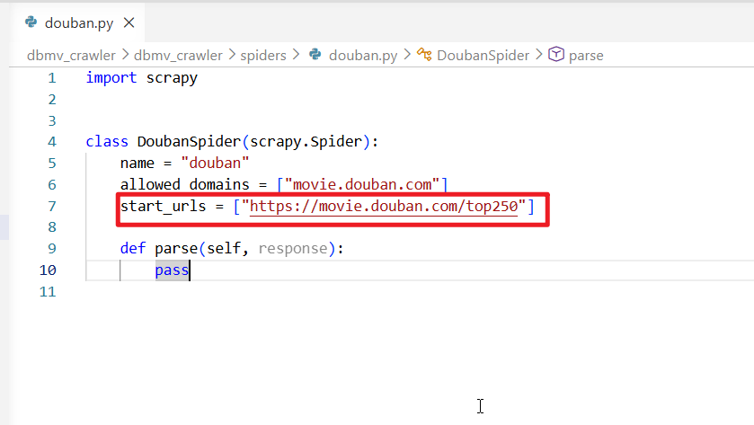

## 4.然后我们需要打开Items.py,在里面创建一个MovieItem类，继承自scrapy.Item

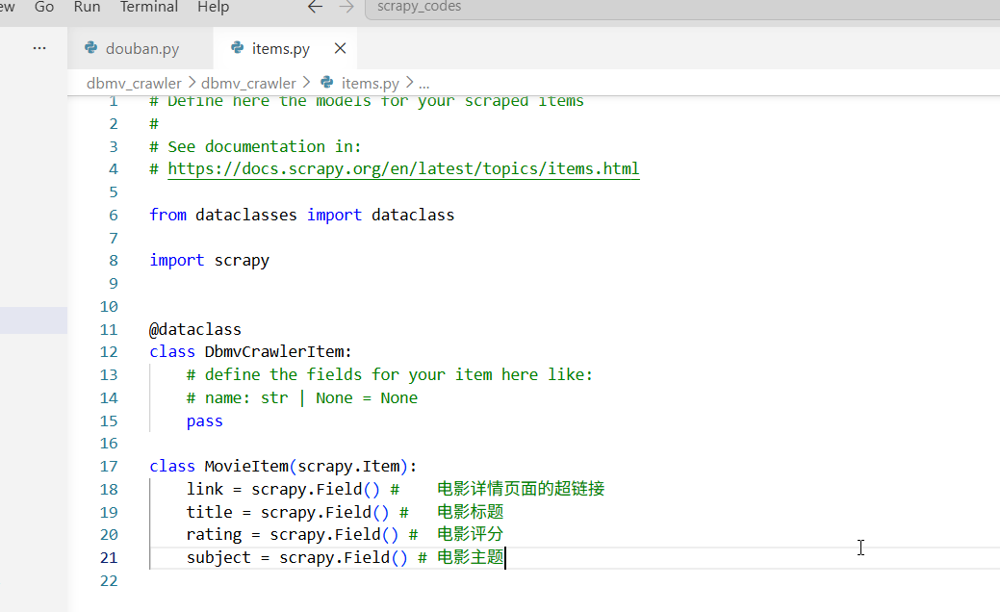

## 5.然后我们回到douban.py文件，继续编写parse方法

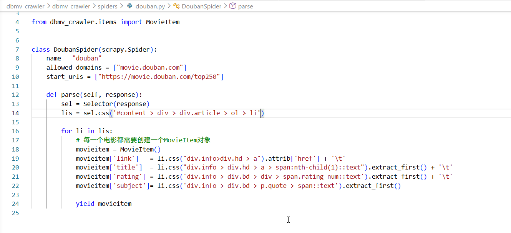

## 6.然后我们需要打开settings.py,把请求头的USER-AGENT设置为浏览器，并且可以配置下载延迟的秒数

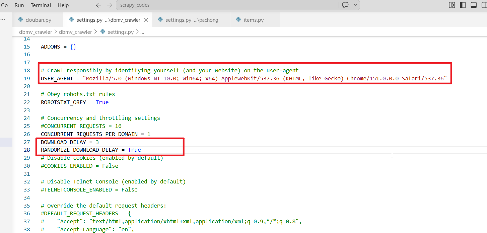

## 7.然后我们使用scrapy crawl douban -o dbmv.csv启动爬虫并且把数据保持到dbmv.csv文件中

```
scrapy crawl douban -o dbmv.csv
```

## 8.然后就拿到一页数据了

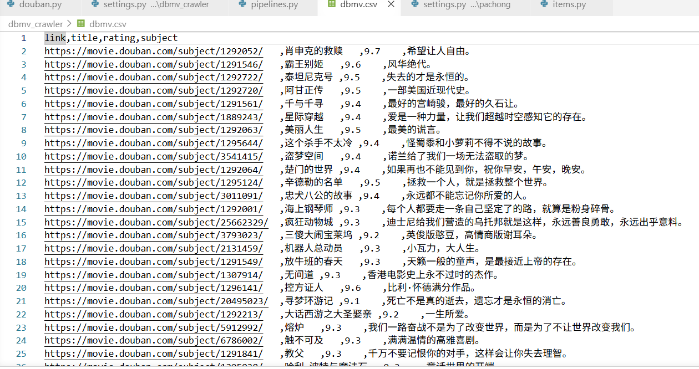

# 2.这一节课我们来学习爬取多页内容

## 1》我们需要把开始url修改一下

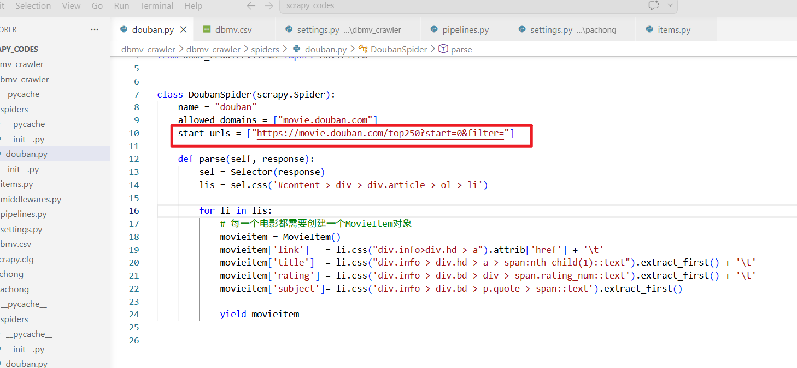

## 2》然后我们在上面的代码下面获取每一页的链接，注意，这个链接需要做路径拼接

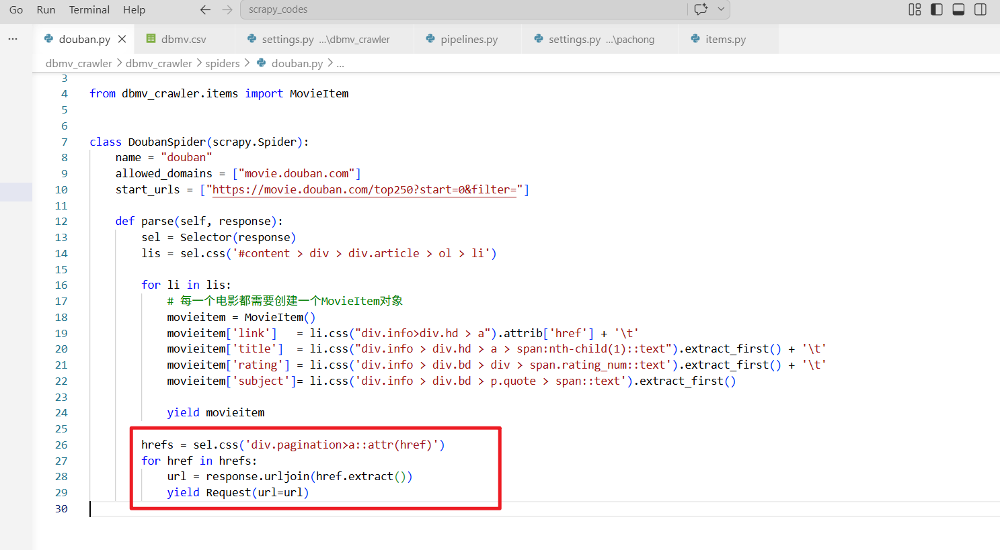

## 3》然后我们运行程序，我们得到了275条数据，因为第一页被爬取了2次

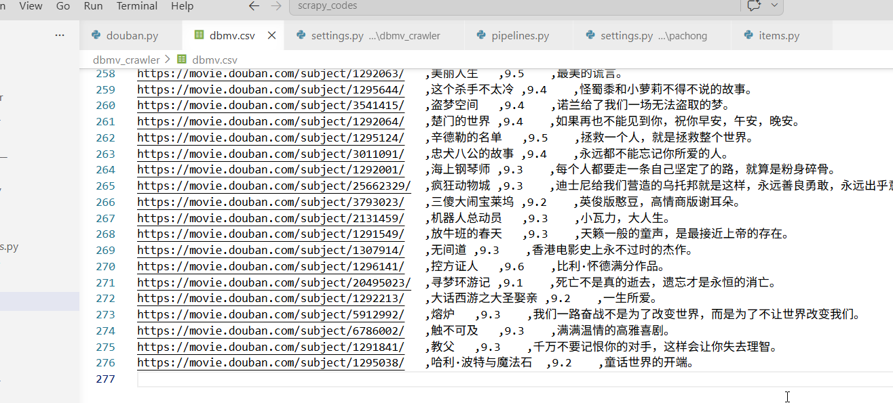

## 4》说明上面的方法不太好，我们用另外一种方法，我们把上面的代码改良一下，不直接给出url，而是先定义一个异步的start方法，先把这个10给页面的请求路径构造好，然后用yield返回，注意老师的scrapy版本比较老，还是使用start_requests这个过时方法，这个方法现在以及没有用了。

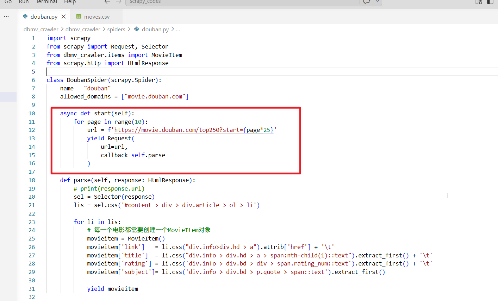


## 5》重新运行项目，这一次输出到movie.csv

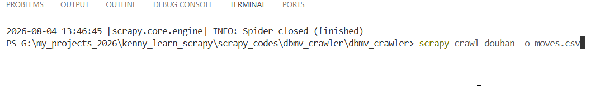

### 此时我们就得到正确的数据了

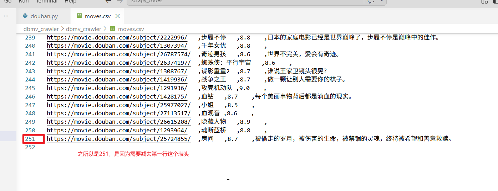
