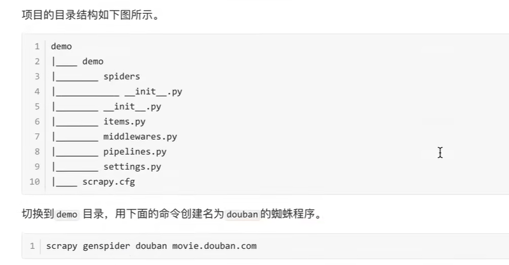
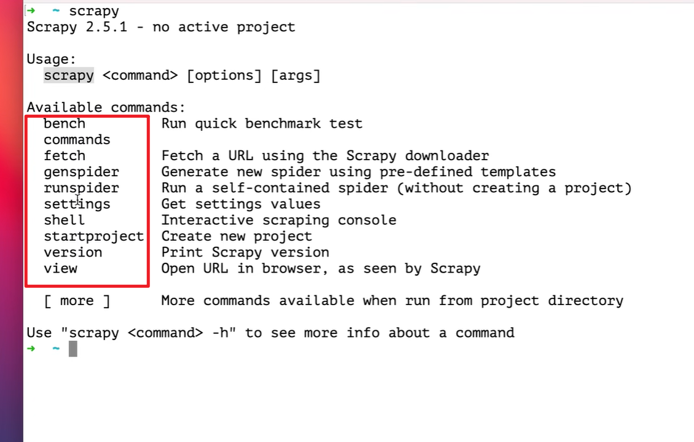
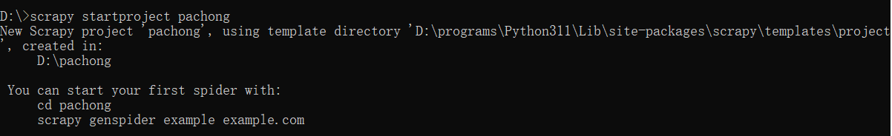
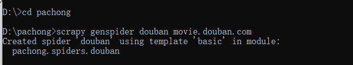
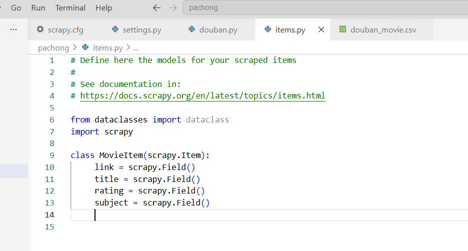
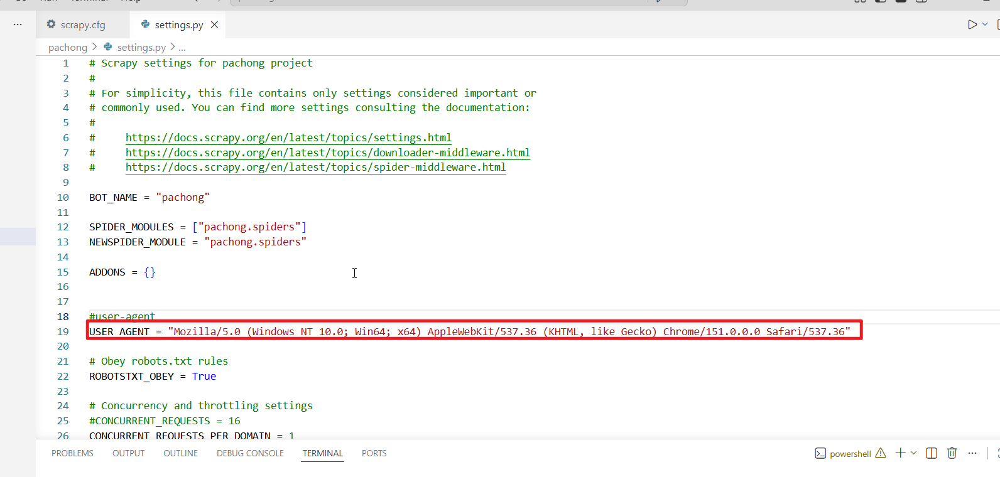
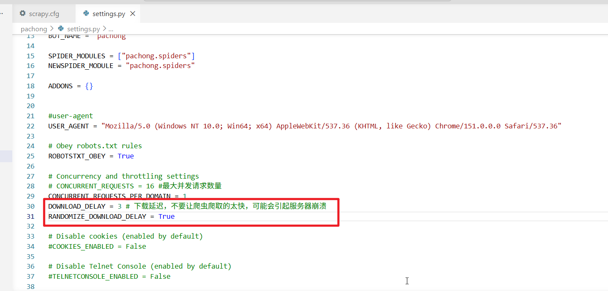
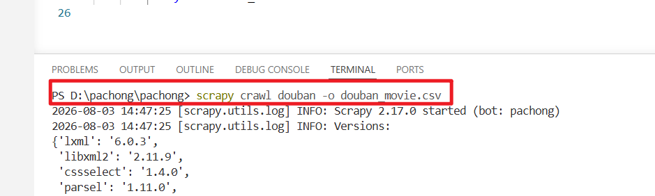

# 1.scrapy的安装

```
pip install scrapy
```


#  2.用scrapy创建项目，比如创建一个demo项目

```
scrapy startproject demo
```

生成的项目的结构如下



             ## 注意，创建蜘蛛的文件夹是demo/demo/，据说，在外层的demo/也可以。是对的。

# 3.scrapy命令后面可以跟的命令



# 4.演练

## 1.端口终端定位到D盘根目录，然后使用scrapy startproject pachong创建一个项目



## 2.进入pachong文件夹，然后输入命令scrapy genspider douban movie.douban.com创建一个豆瓣电影爬虫



## 3.然后我们用vscode打开最外层的pachong文件夹，打开Items.py,把原来的代码删除新建一个MovieItem类继承自scrapy.Item,他的作用是用来封装我们解析页面得到的数据的。你有几个需要解析的条目，你就添加几个字段，注意，定义的名称必须和在蜘蛛程序里面使用的名称一致



## 4.打开spiders/douban.py,然后需要给parse方法添加代码

```
def parse(self, response):
        sel = Selector(response)
        lis =  sel.css('#content > div > div.article > ol > li')
        movie_item = MovieItem()
        for li in lis:
            movie_item['link']= li.css(' div.info > div.hd > a').attrib['href']
            movie_item['title']= li.css('div.info > div.hd > a > span:nth-child(1)::text').extract_first()
            movie_item['rating']= li.css('div.info > div.bd > div > span.rating_num::text').extract_first()
            movie_item['subject'] = li.css("div.info > div.bd > p.quote > span::text").extract_first()
            yield movie_item
```

## 5.此时蜘蛛程序基本完成但是我们还不能够运行，我们需要做请求头伪装，否则我们的爬虫爬取不到数据，我们打开settings.py，取消注释并且修改User-Agent的值如下



## 6.先不配置并发请求数量,配置下载延迟



## 7.运行爬虫，进入第二次pachong文件夹，然后输入下面的命令



## 8.爬取的结果如下

```
link,title,rating,subject
https://movie.douban.com/subject/1292052/	,肖申克的救赎	,9.7	,希望让人自由。
https://movie.douban.com/subject/1291546/	,霸王别姬	,9.6	,风华绝代。
https://movie.douban.com/subject/1292722/	,泰坦尼克号	,9.5	,失去的才是永恒的。 
https://movie.douban.com/subject/1292720/	,阿甘正传	,9.5	,一部美国近现代史。
https://movie.douban.com/subject/1291561/	,千与千寻	,9.4	,最好的宫崎骏，最好的久石让。 
https://movie.douban.com/subject/1889243/	,星际穿越	,9.4	,爱是一种力量，让我们超越时空感知它的存在。
https://movie.douban.com/subject/1292063/	,美丽人生	,9.5	,最美的谎言。
https://movie.douban.com/subject/1295644/	,这个杀手不太冷	,9.4	,怪蜀黍和小萝莉不得不说的故事。
https://movie.douban.com/subject/3541415/	,盗梦空间	,9.4	,诺兰给了我们一场无法盗取的梦。
https://movie.douban.com/subject/1292064/	,楚门的世界	,9.4	,如果再也不能见到你，祝你早安，午安，晚安。
https://movie.douban.com/subject/1295124/	,辛德勒的名单	,9.5	,拯救一个人，就是拯救整个世界。
https://movie.douban.com/subject/3011091/	,忠犬八公的故事	,9.4	,永远都不能忘记你所爱的人。
https://movie.douban.com/subject/1292001/	,海上钢琴师	,9.3	,每个人都要走一条自己坚定了的路，就算是粉身碎骨。 
https://movie.douban.com/subject/25662329/	,疯狂动物城	,9.3	,迪士尼给我们营造的乌托邦就是这样，永远善良勇敢，永远出乎意料。
https://movie.douban.com/subject/3793023/	,三傻大闹宝莱坞	,9.2	,英俊版憨豆，高情商版谢耳朵。
https://movie.douban.com/subject/2131459/	,机器人总动员	,9.3	,小瓦力，大人生。
https://movie.douban.com/subject/1291549/	,放牛班的春天	,9.3	,天籁一般的童声，是最接近上帝的存在。 
https://movie.douban.com/subject/1307914/	,无间道	,9.3	,香港电影史上永不过时的杰作。
https://movie.douban.com/subject/1296141/	,控方证人	,9.6	,比利·怀德满分作品。
https://movie.douban.com/subject/20495023/	,寻梦环游记	,9.1	,死亡不是真的逝去，遗忘才是永恒的消亡。
https://movie.douban.com/subject/1292213/	,大话西游之大圣娶亲	,9.2	,一生所爱。
https://movie.douban.com/subject/5912992/	,熔炉	,9.3	,我们一路奋战不是为了改变世界，而是为了不让世界改变我们。
https://movie.douban.com/subject/6786002/	,触不可及	,9.3	,满满温情的高雅喜剧。
https://movie.douban.com/subject/1291841/	,教父	,9.3	,千万不要记恨你的对手，这样会让你失去理智。
https://movie.douban.com/subject/1295038/	,哈利·波特与魔法石	,9.2	,童话世界的开端。

```

### 注意，这里只是爬取了一个页面的内容，如果需要爬取更多页面需要使用循环，我们下一节课来学习

