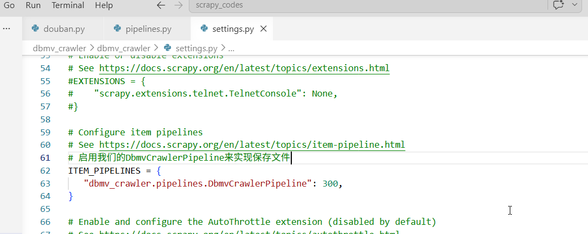
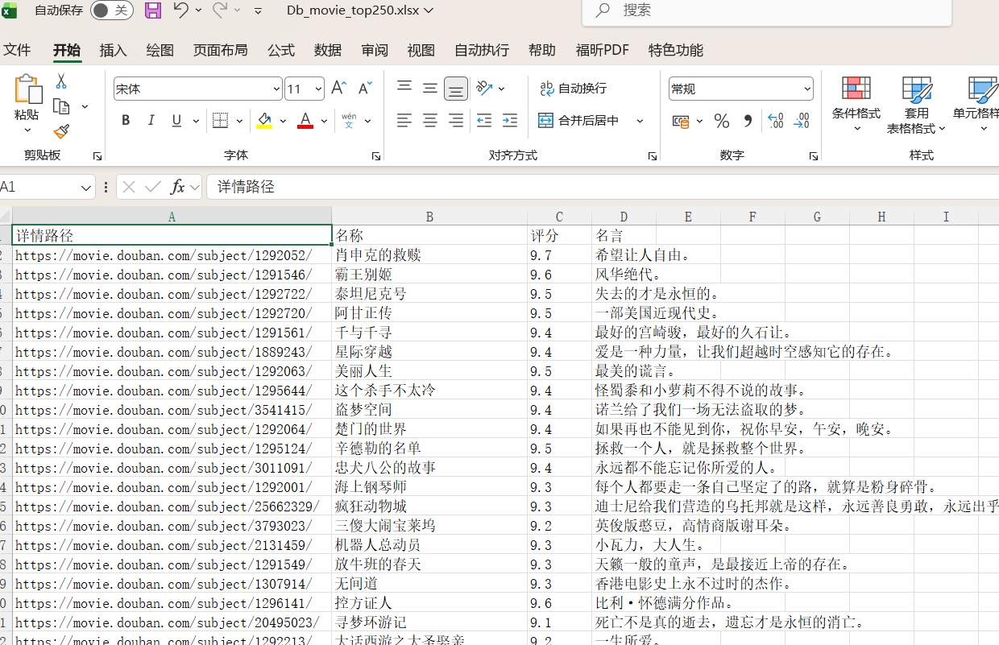

# 还是dbmv_crawler项目，我们这一节课需要学习的就是如何把获取到的数据保存到excel

## 1.打开pipelines.py,修改DbmvCrawlerPipeline类的代码如下

```
from itemadapter import ItemAdapter
import openpyxl

from dbmv_crawler.items import MovieItem


class DbmvCrawlerPipeline:
    def __init__(self):
        self.wb = openpyxl.Workbook()
        self.sheet = self.wb.active
        self.sheet.title="豆瓣电影Top250"
        self.sheet.append(('详情路径','名称', '评分', '名言'))

    def process_item(self, item:MovieItem,spider):
        self.sheet.append((item['link'],item['title'],item['rating'],item['subject']))
        return item

    def close_spider(self,spider):
        self.wb.save("Db_movie_top250.xlsx")
```


## 2.然后打开settings.py,把pipeline的配置打开即可



## 3.运行程序，成功保存数据到excel文件

