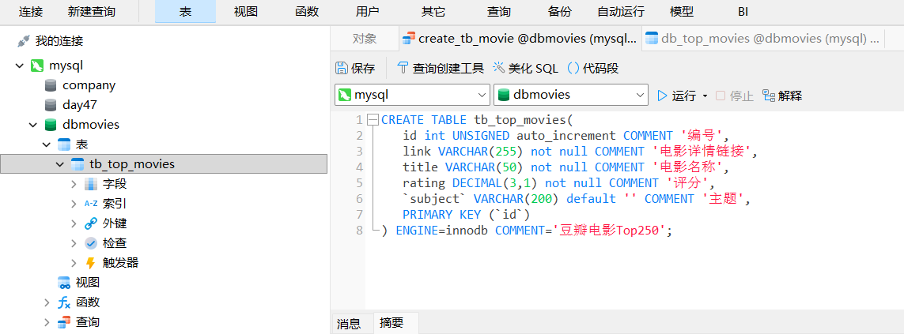
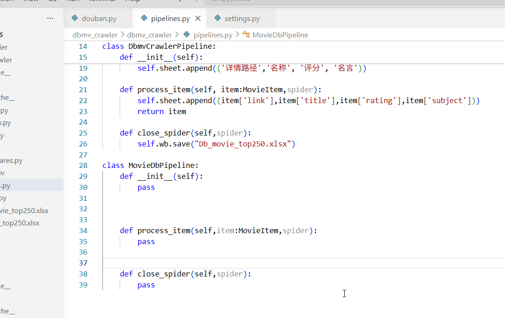
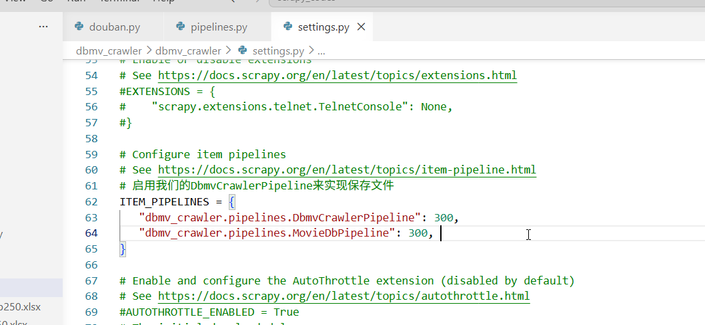
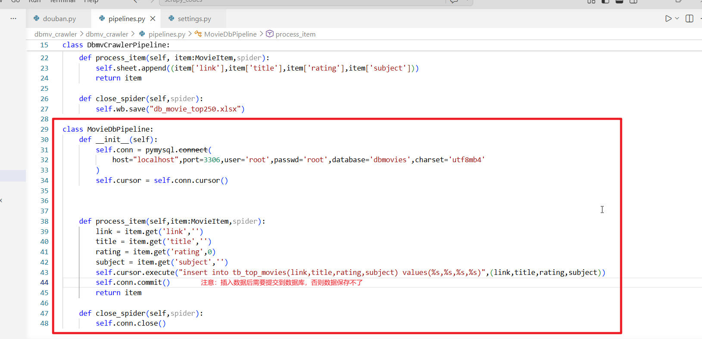
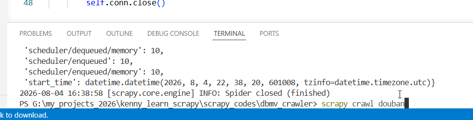
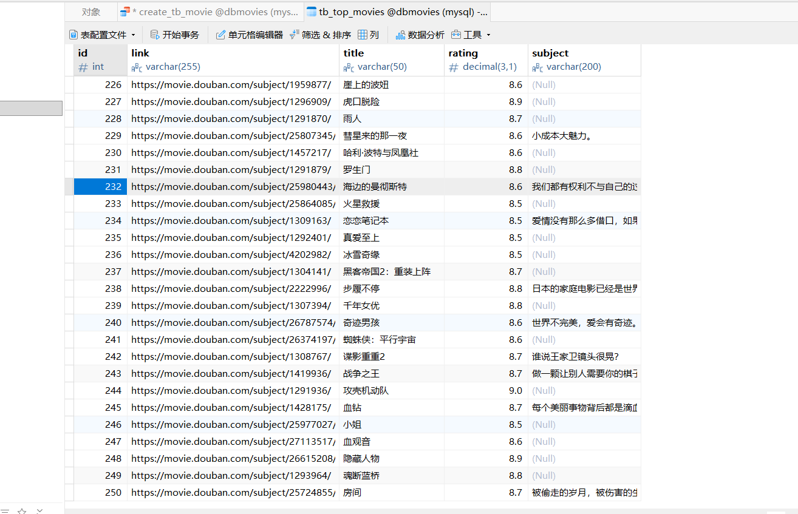

# 还是dbmv_crawler项目。我们这一节课来学习把爬取到的数据保存到mysql数据库

## 注意：

## 1.我们其实可以同时使用两个管道，一个把数据保存到excel，另外一个把数据保存到MySQL。2.我们需要安装MySQL启动比如pymysql

## 1.我们用navcat创建一个dbmovies数据库并且创建一个db_top_moviess数据表

## 2.打开pipelines.py,添加一个保存数据到数据库的MovieDbPipeline类，我们先不写代码，保留一个骨架

## 3.然后我们可以点击settings.py，添加我们的MovieDbPineline

## 4.回到pipelines.py,我们来完成功能

## 5.运行程序，发现数据保存到数据库了

## 下一节，我们来学习scrapy批量保存数据到数据库

