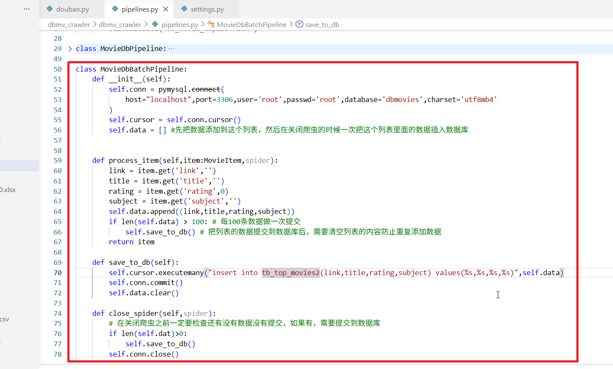
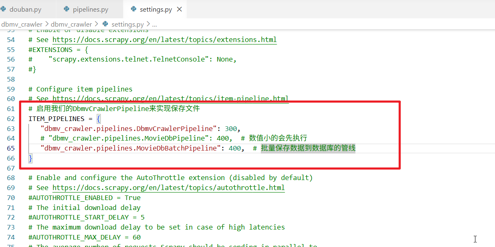
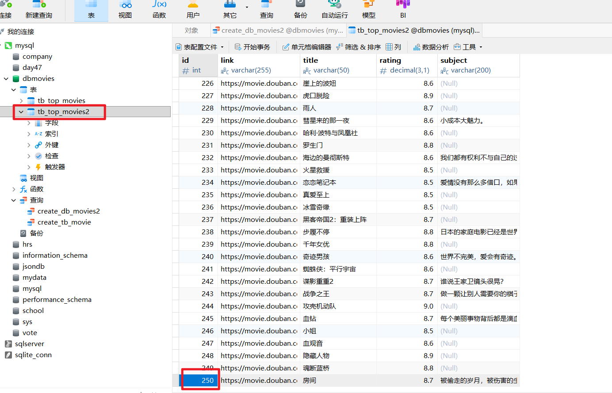
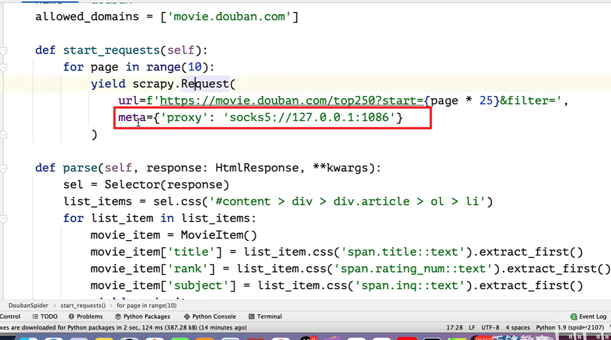

# 还是dbmv_crawler项目，我们来实现批量保存数据到数据库

## 1.为了方便操作，我创建了一个tb_top_movies2数据表，用来测试程序运行是否正确

## 2.打开pipelines.py,我们新建一个MovieDbBatchPipeline，可以复制MovieDbPipeline的代码然后进行适当修改

## 3.然后我们进入settings.py,配置MovieDbBatchPipeline并且注释调MovieDbPipeline的配置

## 4.运行程序，结果正确

## 注意，有时候你的ip会被网站封锁，此时需要使用代理，使用代理需要先设置好你的代理服务器，然后需要在构造请求对象的时候提交一个‘proxy’参数

