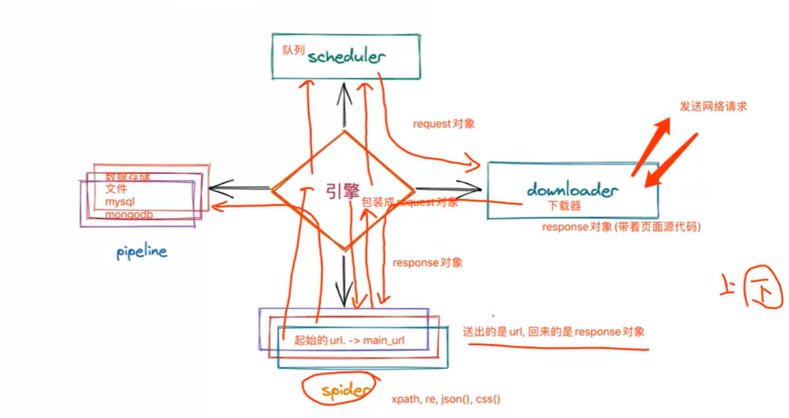

# 1.scrapy是什么？参考scrapy官网

# 2.scrapy运行流程图解

## 大致流程：

引擎先从spider里面获取一个起始url，然后把它包装为一个Request对象然后放进队列，队列把它取出交给下载器，下载器把请求发送给目标服务器，获取到页面数据后把它封装为一个Response对象给引擎，引擎就把它交给spider进行数据解析。spider解析页面后把获取到的数据交给引擎，然后引擎就把它交给管线pipeline，由管线进行保存，可以保存到文件或各种数据库里面。如果spider解析页面后，又得到一些url，它就会重复前面的过程，一直到所有url都发送请求并且解析完毕，此时解析结束，程序退出。

## 注意，这个队列是很有用的。它可以去重，还有判断一个url是否已经爬取过了

