# 我们先来做一个抓取双色球数据的项目

## 1.创建项目，使用命令： scrapy startproject ssq

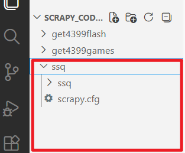

## 2.进入ssq项目，然后用下面的命令创建蜘蛛程序：scrapy genspider ssqclawler 500.com

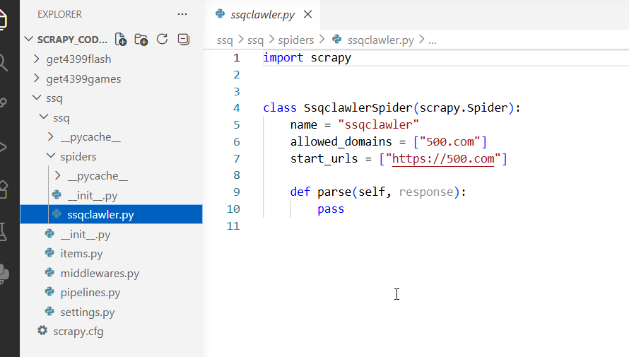

## 3.我们需要修改start_url

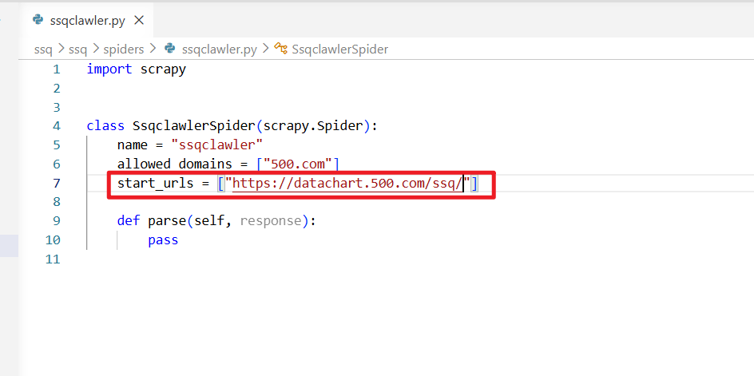

## 4.我们需要在settings.py设置一下请求头的User-Agent参数

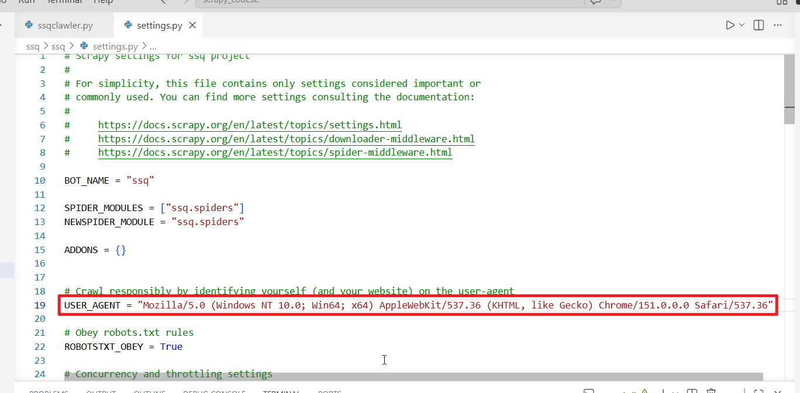

## 5.下面我们来爬取每一行的获奖号码，并且封装数据生成给管道

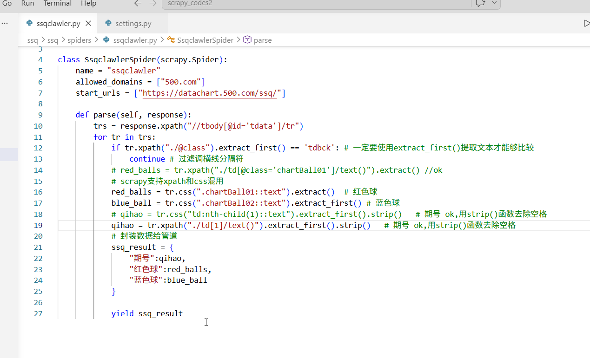

## 6.打开settings.py,把管道配置的内容取消注释，也就是启用管道功能

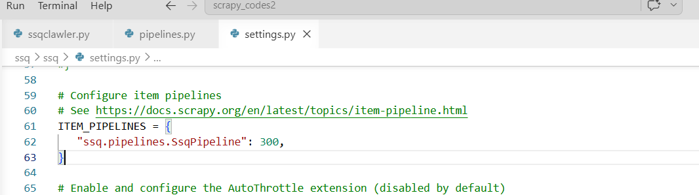

## 7.打开pipelines.py,我们编写配置管道的处理代码，我们先添加一个打印语句看看能否拿到数据

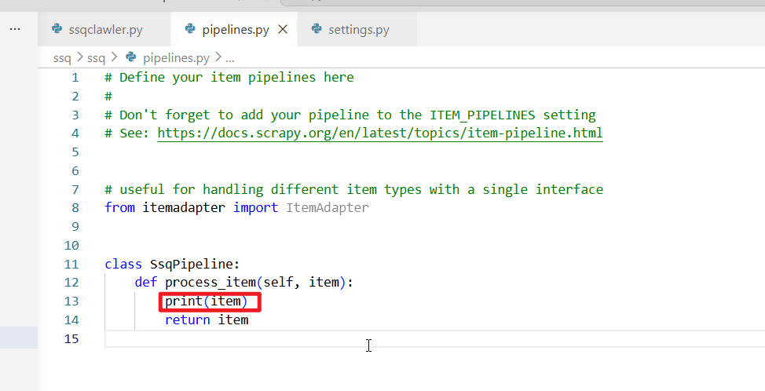

## 运行程序，是可以拿到数据的

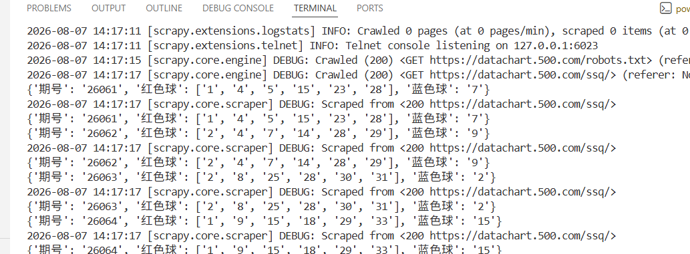

## 我们可以使用这个命令把数据保持到一个csv文件里面：scrapy crawl ssqclawler -o ssqdata.csv

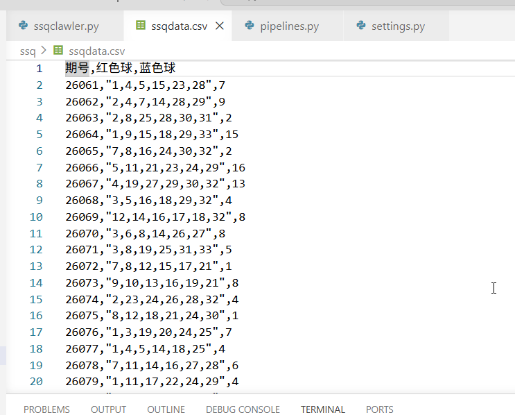

## 注意： 在parse方法中，yield 后面可以跟Request对象，Item对象，None或者字典对象，但是不能够跟列表或元组，会报错，还有，其实直接使用字典也是不推荐的。我们需要创建自己的Item类，继承自scrapy.Item.

## 9.我们打开items.py,发现scrapy已经帮我们生成一个类：SsqItem

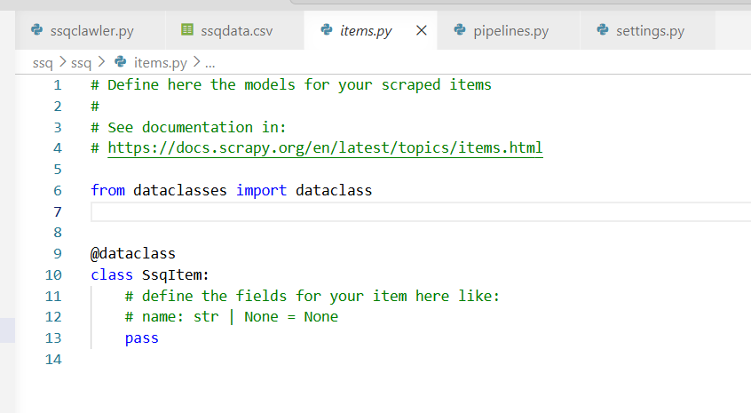

## 10.我们需要对他进行改造，把那个注解删除，并且要继承自scrapy.Item,然后我们就在里面定义我们需要的字段

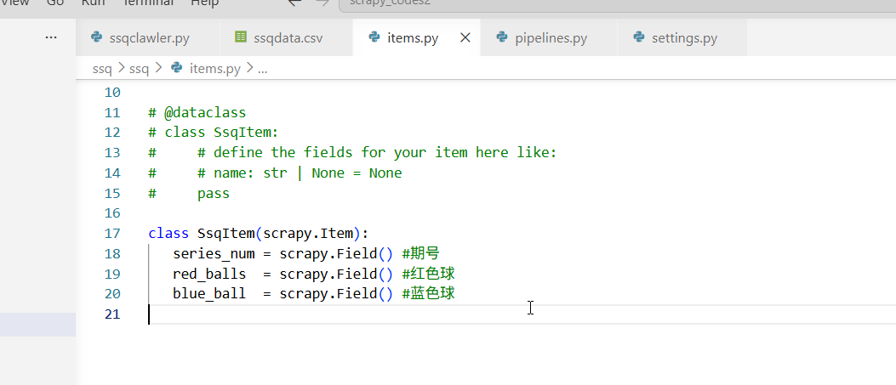

## 11.然后我们需要进入蜘蛛程序，把parse方法改造一下

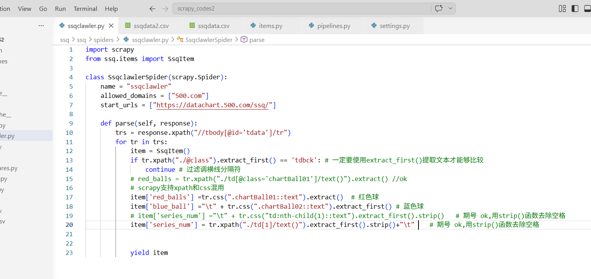

## 12.再次运行项目，发现也是可以拿到数据的

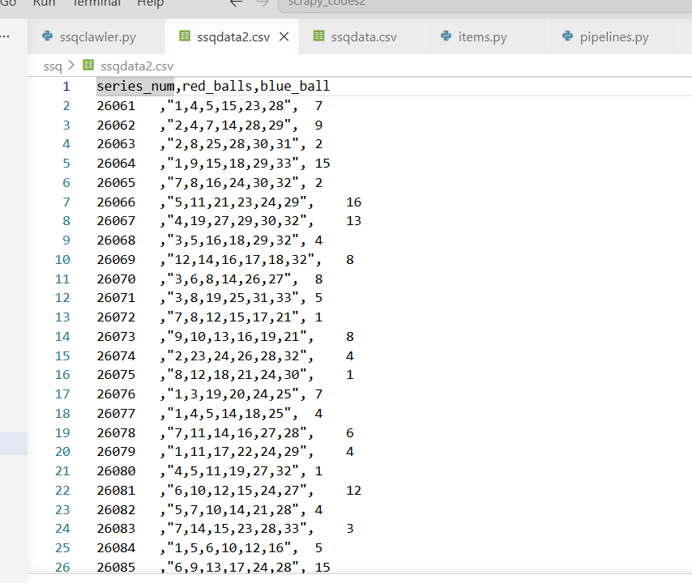

## 另外，我们可以在settings.py里面配置日志级别，过滤一些我们不需要的日志输出

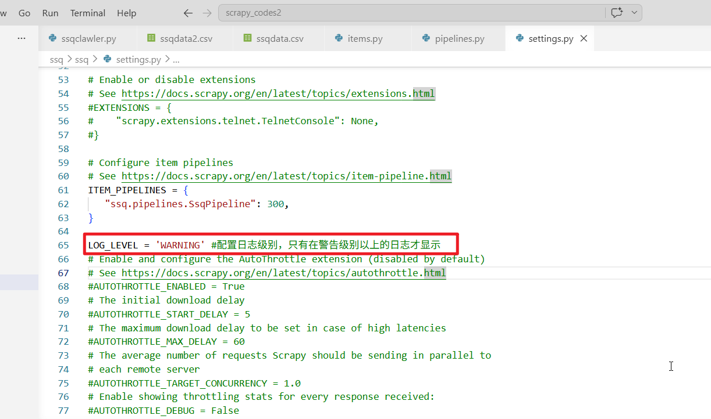